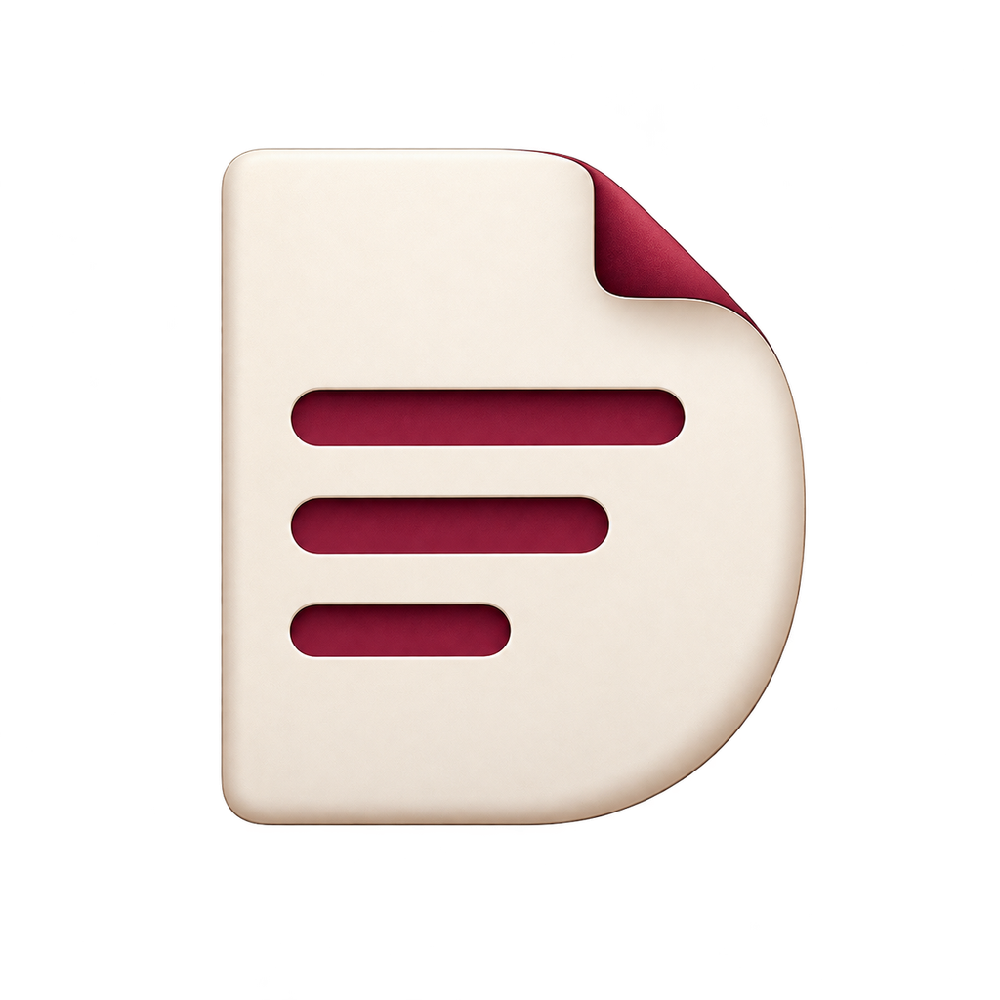
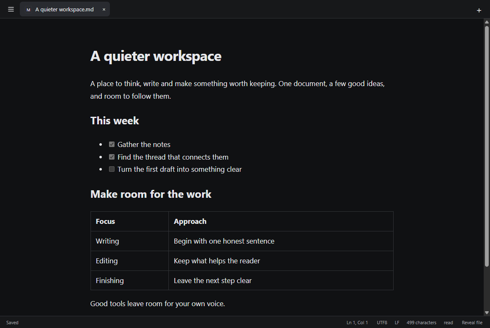

# DEFT

By **Life Imitates Life**

A focused text and Markdown editor for Windows and macOS. Open a file and start writing, without an account, vault, server or subscription.

<!-- downloads:start -->
**0.2.3 prerelease**

- [Download for Windows (.exe, x64)](https://github.com/lifeimitateslife/deft/releases/download/v0.2.3/DEFT.Setup.0.2.3.exe)
- [Download for Mac (Apple Silicon)](https://github.com/lifeimitateslife/deft/releases/download/v0.2.3/DEFT-0.2.3-arm64.dmg)
- [Download for Mac (Intel)](https://github.com/lifeimitateslife/deft/releases/download/v0.2.3/DEFT-0.2.3-x64.dmg)
- [All releases](https://github.com/lifeimitateslife/deft/releases)
<!-- downloads:end -->

## Install

On Windows, the installer defaults to `C:\Program Files\DEFT`; choose Browse to use a custom folder. Installation requires administrator approval. Open the Mac disk image and drag DEFT into Applications. The application includes its runtime; Node.js, Git and developer tools are only needed to build from source.

The [0.2.3 prerelease](https://github.com/lifeimitateslife/deft/releases/tag/v0.2.3) includes checksums, a claim audit, and verification evidence. Try copies of your own files before choosing DEFT as your everyday default.

Builds are unsigned. Windows may show an unknown-publisher warning. Verify the release checksum before choosing to run the installer. On macOS, drag DEFT to Applications. If macOS blocks this unsigned application, use System Settings > Privacy & Security > Open Anyway for DEFT. Do not disable system security.

To choose DEFT for `.md` and `.txt`, use Windows Settings > Apps > Default apps, or Finder > Get Info > Open with > DEFT > Change All. Installation does not require changing defaults.

## Editing

- Plain text and Markdown documents, tabs, native Open/Save dialogs, recent files, and file drops.
- Live Markdown, exact source, and read-only rendered views. Headings, emphasis, tasks, tables, local images, code, and dollar-delimited math.
- Find/replace, undo/redo, go to line, word wrap, line numbers, text size, and read-only editing.
- System appearance by default, plus Light, Dark and custom colors. Preferences includes installed writing and code fonts, independent Glass background opacity and Windows background blur, and Solid material. Native backdrop support depends on the OS.
- HTML export, native Print, and PDF export.
- Explicit Save by default and optional autosave. Closing the app remembers open writing, including unnamed drafts. Deliberately closing a tab discards its unsaved buffer without deleting its file. Closing the final tab shows the welcome screen; +, New Text and New Markdown start fresh tabs.
- One compact app menu and tab strip. Selection formatting appears when relevant; full formatting and view controls remain in the menus. Preferences is directly in the application menu, or the native application menu on macOS.

Any extension, including no extension, can open as text. Markdown extensions select Markdown mode; other files stay plain. UTF-8 and BOM-marked UTF-16 are supported. Binary-looking or invalid UTF-8 files require confirmation; the legacy fallback is reversible Windows-1252. Characters that cannot be saved in the original encoding are rejected; use Save a UTF-8 copy.

Use a formatting command to deliberately format an untitled note or `.txt` file. Formatting writes portable Markdown characters such as `**bold**`, without changing the extension. View > Formatted (Markdown) also lets you opt into a formatted presentation without editing. Plain / Source remains available. Formatting characters can change a script or config's meaning, so those files open plain by default. A reopened `.txt` file starts plain; opt into the formatted view to render its Markdown again.

Opening and switching views do not rewrite files. Saves preserve supported encoding, BOM, mixed line endings, whitespace, and trailing newlines. File replacements use temporary siblings and check for external changes. Clean documents refresh after external edits; dirty documents offer choices.

Remote images are blocked. Local images must be inside the document folder. Paste or drop PNG images into saved Markdown documents to store them in an `assets` subfolder. Embedded HTML is displayed as text.

Clipboard behavior is unchanged: text paste uses the clipboard's plain-text flavor, including any Markdown syntax it contains. Explicitly formatting a `.txt` file does not enable Markdown image importing. General HTML clipboard conversion is not implemented.

## Shortcuts

Use Ctrl on Windows and Command on macOS unless an exception is shown. Menu items and formatting tooltips show their shortcuts.

| Shortcut | Action |
| --- | --- |
| Ctrl/Command+N or T | New text |
| Ctrl/Command+Shift+N | New Markdown |
| Ctrl/Command+O | Open |
| Ctrl/Command+S | Save |
| Ctrl/Command+Shift+S | Save As |
| Ctrl/Command+W | Close tab |
| Ctrl/Command+F | Find |
| Ctrl+H; Command+Option+F on Mac | Replace |
| Ctrl/Command+G or L | Go to line |
| Ctrl/Command+P | Print |
| Ctrl/Command+, | Preferences |
| Ctrl/Command+Z | Undo |
| Ctrl/Command+Y or Shift+Z | Redo |
| Ctrl/Command+A | Select all |
| Ctrl/Command+B, I, K | Bold, italic, link |
| Ctrl/Command+\` | Toggle Source / Plain and formatted view |
| Control+Tab / Control+Shift+Tab | Next / previous tab on either platform |
| Ctrl/Command+Alt+1 through 6 | Heading level |
| Ctrl/Command+Shift+8, 7, 9 | Bullet, numbered, task list |
| Ctrl/Command+Shift+. | Blockquote |
| Ctrl/Command+E | Inline code |
| Ctrl/Command+Shift+K | Code block |
| Ctrl/Command+Shift+X | Strikethrough |
| F11 | Full screen |
| Escape | Close temporary UI |

## Limits

This is an early prerelease. Rich views are limited to documents under 500,000 characters; the file-opening limit is 32 MiB. Recovery is limited to 64 MiB and 100 tabs. Recovery snapshots are debounced by 500 ms, so the last fraction of a second before a crash may be missing.

Live view reveals source for editing tables and math. Some Markdown constructs remain source. Image importing currently accepts PNG. Read-view task boxes are not editable; use Live or Source. No remote image opt-in is provided.

Clear translucency is available on Windows 11 22H2 and later. macOS retains native vibrancy; its blur-off control is disabled. Windows controls Acrylic blur strength and inactive-window appearance. Very low background opacity can reduce readability over busy windows. System accessibility preferences can require a solid background.

External changes are checked every 2.5 seconds. A writer that changes a file in the short interval between the final check and filesystem replacement cannot be completely excluded. Hard links, extended attributes, and custom Windows ACL preservation are not guaranteed. Deleted or renamed files require reopening or Save As. Windows registration and the 0.2.3 Program Files upgrade were tested; interactive default selection and macOS installation remain unverified; see [verification](docs/verification.md).

Settings and recovery live in `%APPDATA%/deft` on Windows and `~/Library/Application Support/deft` on macOS. Uninstalling does not delete documents. Preferences lets you turn off restoration of the previous session. Uninstall through Windows Settings > Apps > Installed apps > DEFT > Uninstall, or remove DEFT from Applications on macOS. Settings and recovery are preserved when uninstalling.

## Development and license

Build instructions, architecture and release maintenance are in [CONTRIBUTING.md](CONTRIBUTING.md). See [verification](docs/verification.md) for tested environments and limits.

Original code is [MIT licensed](LICENSE). Bundled dependencies retain their notices in `THIRD-PARTY-NOTICES.txt` and Electron's license files. The logo is the approved original artwork; platform icons are technical exports of that exact image.
