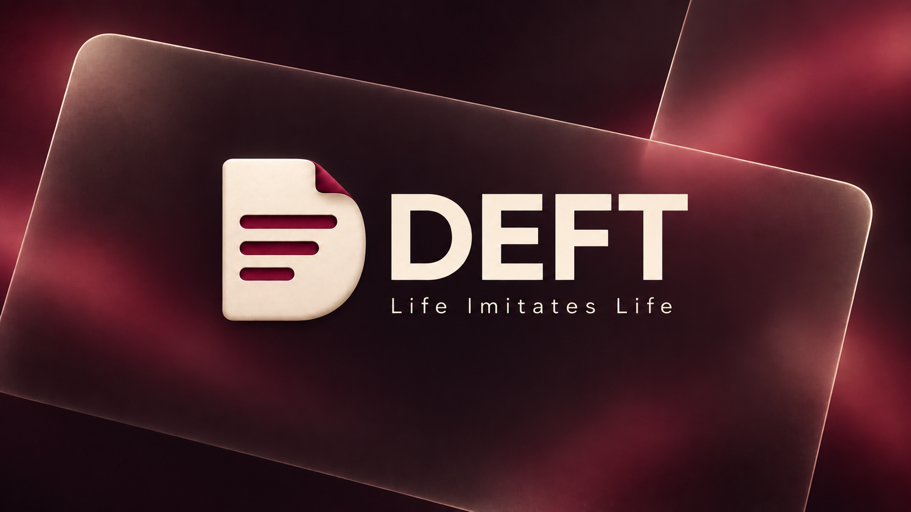
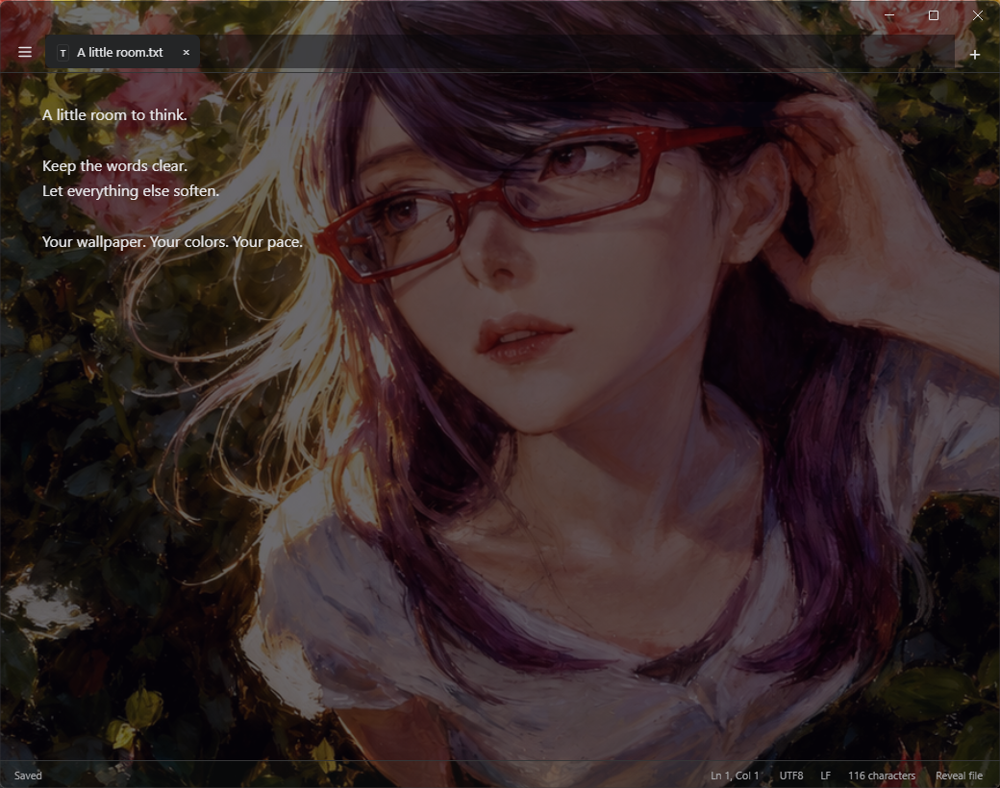
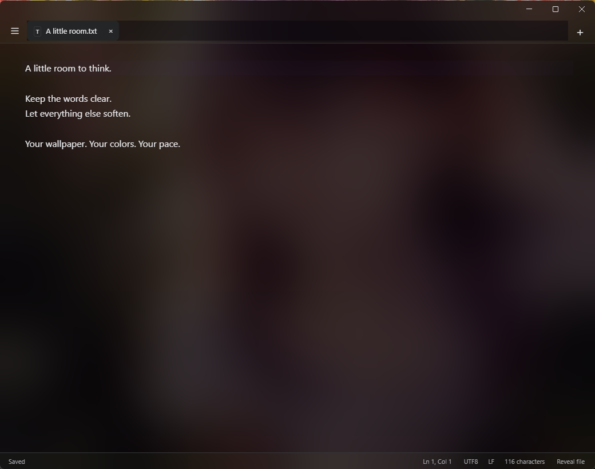
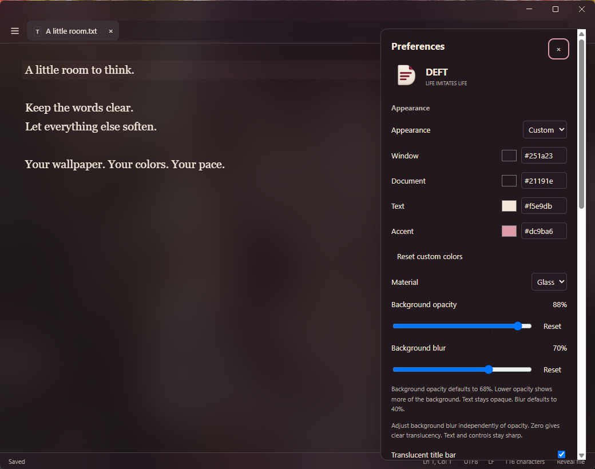
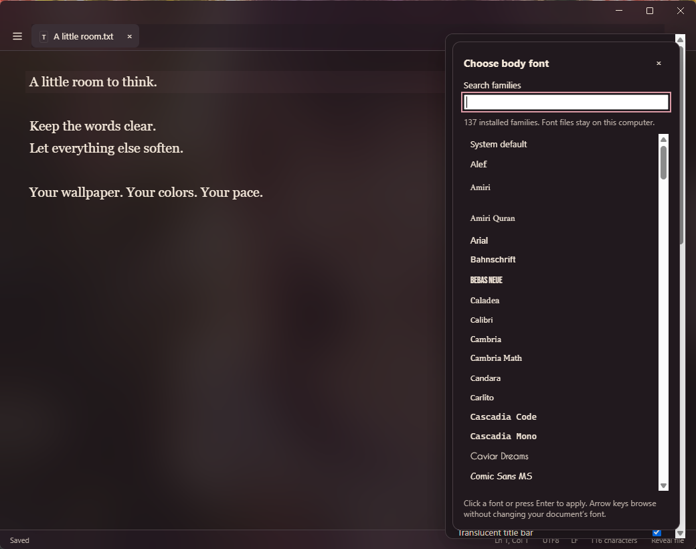

A focused text and Markdown editor for Windows and macOS. Open a file and start writing, without an account, vault, server or subscription.

<!-- downloads:start -->
**0.2.9 prerelease**

- [Download for Windows (.exe, x64)](https://github.com/lifeimitateslife/deft/releases/download/v0.2.9/DEFT.Setup.0.2.9.exe)
- [Download for Mac (Apple Silicon)](https://github.com/lifeimitateslife/deft/releases/download/v0.2.9/DEFT-0.2.9-arm64.dmg)
- [Download for Mac (Intel)](https://github.com/lifeimitateslife/deft/releases/download/v0.2.9/DEFT-0.2.9-x64.dmg)
- [All releases](https://github.com/lifeimitateslife/deft/releases)
<!-- downloads:end -->

Your desktop, softened. Your writing, sharp. Shown with a custom dark palette, **8% background opacity and 14% blur**.

### Make it yours

Start with System, Light or Dark, or build a **Custom** theme around your own colors and fonts. Background opacity and blur stay independent, so the look can change without fading your writing.

#### Clear, with contrast

Light text over a dark tint keeps the words readable while the wallpaper stays unblurred. **60% opacity, 0% blur**, with a translucent title bar.

#### Frosted and focused

Turn up blur to soften the background, then set opacity to suit your writing. **75% opacity, 90% blur**, with a translucent title bar.

#### Your palette, down to the accent

Custom themes let you set **window, document, text and accent colors individually**, using color swatches or hex values. Pair a warm background with cream text and a rose accent, or choose an entirely different combination. The accent carries through details such as focus outlines, while your writing keeps its own text color.

Shown below: a plum-and-cream custom theme with **Georgia, 88% opacity and 70% blur**. These are editable choices, not a fixed preset.

#### Your type, independently

Pair your palette with a writing font you enjoy. **Browse or search installed families**, see each family rendered in its own typeface, and click to apply it. Choose the **body font and source/code font separately**, then adjust text size in Preferences. A serif writing font can sit alongside a monospace code font without changing your theme colors.

Available font families depend on your computer; font files stay local. These are real desktop-composited captures of installed DEFT 0.2.9 at 1040 x 820 pixels, shown full-width here without upscaling or simulated blur. Your wallpaper and colors affect contrast. The title strip has no name or logo on Windows or Mac.

## Organize tabs and reopen files

Drag a tab to reorder it on Windows or Mac. It follows the pointer while neighboring tabs slide aside, then settles into place on release. Drag near an edge to scroll through overflow tabs, or press Escape to cancel. App and system reduced-motion settings disable the settling animations. To reorder with the keyboard, focus a tab and press Alt+Left or Alt+Right. Reordering preserves the active document, edits and undo history. Tab order is restored when session restoration is enabled.

**Recent files** is the first entry in the three-bar application menu on both platforms. It is not on the tab strip, welcome screen or in File. Folder paths distinguish files with the same name. Selecting a file that is already open switches to its existing tab without closing other documents.

## Optional translucent title bar

In Preferences, enable **Translucent title bar** to let the DEFT title surface follow the same background blur and opacity as the editor. Off is the default and keeps the title surface opaque. Windows caption buttons and Mac traffic lights remain native; the title strip hides in fullscreen. Solid mode and system accessibility transparency settings override translucency without erasing the preference. Blur strength remains independent of opacity.

## Update notifications

Starting with 0.2.5, DEFT quietly checks this repository's public GitHub releases on launch and at most once a day while running. When a newer numbered release has an installer for your Windows PC or Mac, a small notice offers **View update**. That opens the official release page; you download and install it yourself. DEFT does not replace itself or restart your work.

Dismiss a notice to hide that version across restarts. Future versions can notify you again. Offline or rate-limited checks stay quiet. Public numbered prereleases are included because DEFT currently ships as a prerelease. Checks send an ordinary request to GitHub, with no document contents, filenames or account credentials.

Install 0.2.5 or later manually once to receive future notices. Older versions do not have this feature.

## Install

On Windows, the installer defaults to `C:\Program Files\DEFT`; choose Browse to use a custom folder. Installation requires administrator approval. Open the Mac disk image and drag DEFT into Applications. The application includes its runtime; Node.js, Git and developer tools are only needed to build from source.

The [0.2.9 prerelease](https://github.com/lifeimitateslife/deft/releases/tag/v0.2.9) removes the title-strip name and logo on Windows and Mac. Animated tab reordering, menu-only Recent files, the optional translucent title bar, independent adjustable background blur and update notices remain included. The release includes checksums, a claim audit and verification evidence. Try copies of your own files before choosing DEFT as your everyday default.

DEFT is free and open source. Windows builds have no verified publisher and may show an unknown-publisher warning. Mac builds use a free ad-hoc signature and are not Apple-notarized, so macOS may block the first launch. Download from this repository and verify the release checksum.

**Mac first launch:** Drag DEFT into Applications and try opening it once. If macOS blocks it, dismiss the alert, open **System Settings > Privacy & Security**, scroll down, and choose **Open Anyway** for DEFT. Authenticate if asked, then choose **Open**. macOS saves an exception for that app. These are [Apple's documented steps](https://support.apple.com/en-us/102445); organization-managed Macs may restrict them. The disk image includes `INSTALL-MAC.txt`.

Version 0.2.4 repairs the incomplete app signature in the 0.2.3 Mac download. It does not remove Apple's first-launch security check. Do not disable Gatekeeper or System Integrity Protection system-wide. See [Mac installation and signing details](docs/mac-signing.md).

To choose DEFT for `.md` and `.txt`, use Windows Settings > Apps > Default apps, or Finder > Get Info > Open with > DEFT > Change All. Installation does not require changing defaults.

## Editing

- Plain text and Markdown documents, tabs, native Open/Save dialogs, recent files, and file drops.
- Live Markdown, exact source, and read-only rendered views. Headings, emphasis, tasks, tables, local images, code, and dollar-delimited math.
- Find/replace, undo/redo, go to line, word wrap, line numbers, text size, and read-only editing.
- System appearance by default, plus Light, Dark and custom colors. Preferences includes installed writing and code fonts, independent Glass background opacity and background blur, and Solid material. Native backdrop support depends on the OS.
- HTML export, native Print, and PDF export.
- Explicit Save by default and optional autosave. Closing the app remembers open writing, including unnamed drafts. Deliberately closing a tab discards its unsaved buffer without deleting its file. Closing the final tab shows the welcome screen; +, New Text and New Markdown start fresh tabs.
- One compact app menu and tab strip. Selection formatting appears when relevant; full formatting and view controls remain in the menus. Preferences is directly in the application menu, or the native application menu on macOS.

Any extension, including no extension, can open as text. Markdown extensions select Markdown mode; other files stay plain. UTF-8 and BOM-marked UTF-16 are supported. Binary-looking or invalid UTF-8 files require confirmation; the legacy fallback is reversible Windows-1252. Characters that cannot be saved in the original encoding are rejected; use Save a UTF-8 copy.

Use a formatting command to deliberately format an untitled note or `.txt` file. Formatting writes portable Markdown characters such as `**bold**`, without changing the extension. View > Formatted (Markdown) also lets you opt into a formatted presentation without editing. Plain / Source remains available. Formatting characters can change a script or config's meaning, so those files open plain by default. A reopened `.txt` file starts plain; opt into the formatted view to render its Markdown again.

Opening and switching views do not rewrite files. Saves preserve supported encoding, BOM, mixed line endings, whitespace, and trailing newlines. File replacements use temporary siblings and check for external changes. Clean documents refresh after external edits; dirty documents offer choices.

Remote images are blocked. Local images must be inside the document folder. Paste or drop PNG images into saved Markdown documents to store them in an `assets` subfolder. Embedded HTML is displayed as text.

Clipboard behavior is unchanged: text paste uses the clipboard's plain-text flavor, including any Markdown syntax it contains. Explicitly formatting a `.txt` file does not enable Markdown image importing. General HTML clipboard conversion is not implemented.

## Shortcuts

Use Ctrl on Windows and Command on macOS unless an exception is shown. Menu items and formatting tooltips show their shortcuts.

| Shortcut | Action |
| --- | --- |
| Ctrl/Command+N or T | New text |
| Ctrl/Command+Shift+N | New Markdown |
| Ctrl/Command+O | Open |
| Ctrl/Command+S | Save |
| Ctrl/Command+Shift+S | Save As |
| Ctrl/Command+W | Close tab |
| Ctrl/Command+F | Find |
| Ctrl+H; Command+Option+F on Mac | Replace |
| Ctrl/Command+G or L | Go to line |
| Ctrl/Command+P | Print |
| Ctrl/Command+, | Preferences |
| Ctrl/Command+Z | Undo |
| Ctrl/Command+Y or Shift+Z | Redo |
| Ctrl/Command+A | Select all |
| Ctrl/Command+B, I, K | Bold, italic, link |
| Ctrl/Command+\` | Toggle Source / Plain and formatted view |
| Control+Tab / Control+Shift+Tab | Next / previous tab on either platform |
| Ctrl/Command+Alt+1 through 6 | Heading level |
| Ctrl/Command+Shift+8, 7, 9 | Bullet, numbered, task list |
| Ctrl/Command+Shift+. | Blockquote |
| Ctrl/Command+E | Inline code |
| Ctrl/Command+Shift+K | Code block |
| Ctrl/Command+Shift+X | Strikethrough |
| F11 | Full screen |
| Escape | Close temporary UI |

## Limits

This is an early prerelease. Rich views are limited to documents under 500,000 characters; the file-opening limit is 32 MiB. Recovery is limited to 64 MiB and 100 tabs. Recovery snapshots are debounced by 500 ms, so the last fraction of a second before a crash may be missing.

Live view reveals source for editing tables and math. Some Markdown constructs remain source. Image importing currently accepts PNG. Read-view task boxes are not editable; use Live or Source. No remote image opt-in is provided.

Clear translucency and adjustable background blur are available on macOS and Windows 11 22H2 and later. Background blur runs from 0 to 100, with a default of 40. Zero is clear. Background opacity independently changes the background fill while text and controls stay opaque. Mac blur uses a private system API; Windows blur uses Windows Composition. If a native backend is unavailable or reports a failure, Preferences falls back to a system blur toggle. Future OS or graphics changes may affect native blur support. Very low background opacity can reduce readability over busy windows. System accessibility preferences can require a solid background.

External changes are checked every 2.5 seconds. A writer that changes a file in the short interval between the final check and filesystem replacement cannot be completely excluded. Hard links, extended attributes, and custom Windows ACL preservation are not guaranteed. Deleted or renamed files require reopening or Save As. Windows registration and the 0.2.3 Program Files upgrade were tested; interactive default selection and browser-quarantined Mac first-launch approval remain unverified. The 0.2.7 packaged app passed automated tests on Windows and both Mac architectures; see the [0.2.7 claim audit](https://github.com/lifeimitateslife/deft/releases/download/v0.2.7/CLAIM-AUDIT.md) and [earlier verification](docs/verification.md).

Settings and recovery live in `%APPDATA%/deft` on Windows and `~/Library/Application Support/deft` on macOS. Uninstalling does not delete documents. Preferences lets you turn off restoration of the previous session. Uninstall through Windows Settings > Apps > Installed apps > DEFT > Uninstall, or remove DEFT from Applications on macOS. Settings and recovery are preserved when uninstalling.

## Development and license

Build instructions, architecture and release maintenance are in [CONTRIBUTING.md](CONTRIBUTING.md). See [verification](docs/verification.md) for tested environments and limits.

Original code is [MIT licensed](LICENSE). Bundled dependencies retain their notices in `THIRD-PARTY-NOTICES.txt` and Electron's license files. The logo is the approved original artwork; platform icons are technical exports of that exact image.
